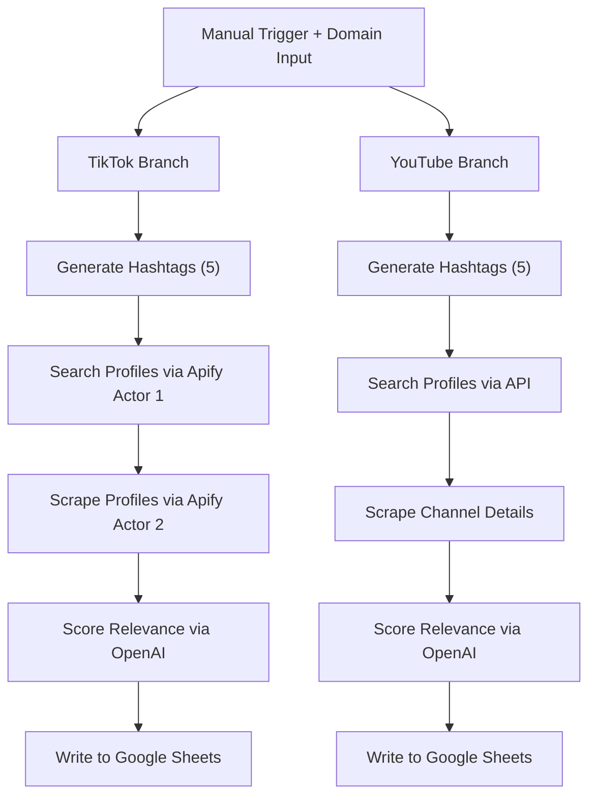

# 📄 Technical Specification: Content Creator Search Engine (n8n Workflow)

## 1. Overview

This n8n workflow is a Content Creator Search Engine that discovers niche content creators on **YouTube** and **TikTok** based on a user-defined domain (e.g., "budget skincare", "affordable wrist watches"). The workflow is built to support marketing/outreach systems by identifying relevant creators, scoring their content, and exporting structured results to Google Sheets.

This workflow carries out a set process for both tiktok and youtube separately. However the workflow is sequentially arranged to get tiktok results first.

---

## 2. Workflow Structure

The workflow is composed of **four major sections**, each implemented for both platforms:

1. **Search Query / Hashtag Generation**
2. **Content Creator Discovery & Scraping**
3. **Scoring & Metric Calculation**
4. **Google Sheets Output**

> ❗There are **no shared processing sections** except for the initial `domain` input — each platform runs its complete processing pipeline independently.

---

## 3. Trigger

- **Chat Node Trigger** (via n8n UI for now)
- Future option: Webhook endpoint or scheduled batch processing

---

## 4. Inputs

| Parameter | Type   | Description                                             |
| --------- | ------ | ------------------------------------------------------- |
| `domain`  | String | Niche/topic to search for (e.g., "budget smartwatches") |

This input is used separately by both branches to generate their respective queries/hashtags.

---

## 5. Section 1: Query / Hashtag Generation

### 5.1 TikTok Branch

- Uses **Gemini 2.5 flash** to generate **5 hashtags** related to the `domain`.
- Prompt is tuned to return short, platform-native hashtags.
- Example Output:
  - `#budgetwatches`
  - `#watchtok`
  - `#cheapwatches`

### 5.2 YouTube Branch

- Uses **Gemini 2.5 flash** to generate **3 keyword-rich search queries**.
- Tailored to YouTube’s video search pattern.
- Example Output:
  - "best affordable smartwatches 2024"
  - "cheap fitness tracker unboxing"

---

## 6. Section 2: Creator Discovery / Scraping

### 6.1 TikTok Discovery (Apify Actors)

#### 6.1.1 Actor 1: TikTok Hashtag Search

- Searches TikTok using Apify Actor with each of the 5 generated hashtags.
- Extracts a short list of creator profile URLs (2 profiles per hashtag).
- Total: ~10 TikTok profiles.

#### 6.1.2 Actor 2: TikTok Profile Scraper

- For each profile URL, uses a second Apify Actor to scrape:
  - Username
  - Bio
  - Follower count
  - Number of public videos
  - Profile URL

### 6.2 YouTube Discovery (YouTube Data API)

- Uses official YouTube Data API v3.
- For each of the 3 generated queries:
  - Executes `search.list` for channels.
- Uses `channels.list` to fetch:
  - Channel name, ID, creation date
  - Subscriber count
  - Total videos
  - Channel description and title

> Total of 4 YouTube channels per search query = ~12 YouTube creators.

---

## 7. Section 3: Scoring & Metrics Calculation

Each platform has its own relevance scoring model using **Gemini 2.0 flash**.

### 7.1 TikTok Scoring

- Input: bio, hashtags, and recent captions (if any).
- Prompt asks GPT to:

  - Score from three categories(S,A,B) on how relevant the creator’s content is to the given domain.
  - Provide a brief explanation of the score.

- Output Fields:
  - `relevance_score`
  - `reasoning`
  - `profile_age` (calculated from earliest post date, if available)

### 7.2 YouTube Scoring

- Input: channel title + description.
- Prompt asks GPT to:

  - Rate channel’s relevance to the given domain (0–10)
  - Justify the score briefly.

- Output Fields:
  - `relevance_score`
  - `reasoning`
  - `profile_age` (based on channel creation date)

> Scoring is performed **independently** and in parallel across both branches.

---

## 8. Section 4: Google Sheets Output

- TikTok and YouTube results are **tagged by platform** in the same sheet.
- Output fields (per row):

| Platform | Creator Name | URL | Subscribers/Followers | Videos | Relevance Score | Reasoning | Profile Age | Location | Contact |
| -------- | ------------ | --- | --------------------- | ------ | --------------- | --------- | ----------- | -------- | ------- |

- Uses the Google Sheets node to:
  - Append data to the sheet
  - Ensure atomic writes (one per creator)
  - Optionally timestamp entrie

---

## 9. External Integrations

| Service                                        | Role                                       |
| ---------------------------------------------- | ------------------------------------------ |
| Gemini 2.5flash                                | Query/hashtag generation + content scoring |
| Apify Actor 1:clockworks~tiktok-scraper        | TikTok hashtag-based profile search        |
| Apify Actor 2:thenetaji~tiktok-profile-scraper | TikTok profile scraping                    |
| YouTube Data API v3                            | Video/channel search and metadata          |
| Google Sheets                                  | Final output storage                       |

---

## 10. Known Limitations

- TikTok profiles may not always have sufficient public data (esp. captions).
- Apify actors are limited to 2 profiles per hashtag (can be increased at higher cost).
- Relevance scoring is based on available text; video content is not analyzed directly.
- Contact info is often unavailable or hidden, especially on TikTok.

---

## Configuration

This workflow requires the following environment variables to be set in `.env` or in n8n credentials:

| Variable Name    | Description         | Example Value           |
| ---------------- | ------------------- | ----------------------- |
| YOUR_APIFY_KEY   | API token for Apify | `your-apify-token-here` |
| YOUR_YOUTUBE_KEY | API key for youtube | `your-youtube-key-here` |

---

## 11. Assumptions

- The domain input is specific enough to generate relevant queries/hashtags.
- Both platforms are treated equally but independently.
- Apify accounts are authenticated via n8n's credential store.
- The user has sufficient YouTube API quota and valid Google Sheets credentials.
- TikTok scraping via Apify is compliant with usage policies.

---

## 12. Future Enhancements

- Add platform selector (`YouTube`, `TikTok`, `Both`) to allow selective runs.
- Increase profiles per hashtag/query (configurable from input).
- Expand profile scraping with email discovery tools or external enrichment APIs.
- Add filters like minimum followers, verified status, or country.
- Export to Airtable or internal database in addition to Google Sheets.

---

## 13. Mermaid Diagram: Parallel Platform Branches

